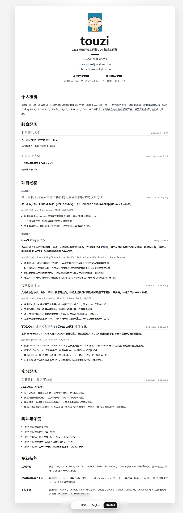

# touzi个人主页

这是一个纯静态个人主页，用于展示个人信息、教育经历、实习经历、项目经历、奖项荣誉和技能栈。页面支持中英文双语切换，并内置一个本地管理员面板，用来控制每条经历或项目是否显示。



## 功能

- 中英文双语切换
- 简历式个人主页布局
- 管理员登录入口
- 支持编辑教育、实习、项目、荣誉、技能内容
- 支持单独控制每条教育经历、项目经历等是否显示
- 支持导入、导出页面配置
- 使用头像作为网站图标

## 管理员

页面右上角点击“管理”进入登录。

```text
账号: admin
密码: admin
```

这是静态网页，没有后端数据库。管理员修改会保存在当前浏览器的 `localStorage` 中。如果需要把修改发布到线上所有访客可见，可以在管理面板中导出配置，再把内容同步到 `static/js/profile-data.js`。

## 项目结构

```text
.
├── index.html
├── LICENSE
├── README.md
└── static
    ├── assets
    │   ├── favicon.png
    │   └── img
    │       └── photo.png
    ├── css
    │   └── main.css
    └── js
        ├── profile-data.js
        └── scripts.js
```

## 修改内容

- 页面文案和经历数据：`static/js/profile-data.js`
- 页面交互逻辑：`static/js/scripts.js`
- 页面样式：`static/css/main.css`
- 头像：`static/assets/img/photo.png`
- 网站图标：`static/assets/favicon.png`

## 本地预览

这是静态页面，可以直接用浏览器打开 `index.html`。如果浏览器对本地文件有限制，也可以在项目目录启动一个简单静态服务。

```bash
python -m http.server 8000
```

然后访问：

```text
http://localhost:8000
```
